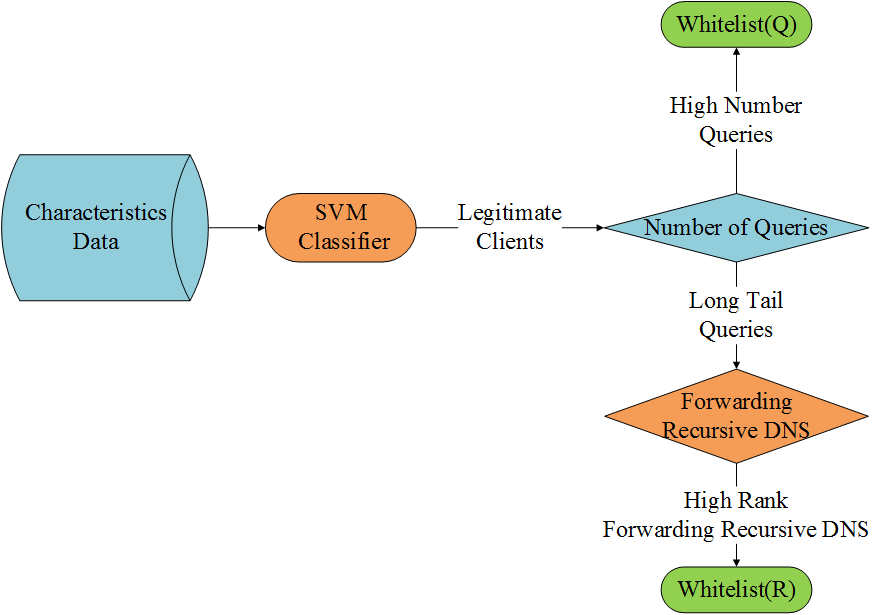

# dns_tld_ddos_whitelist_mitigating
dns tld ddos whitelist_mitigating  生成可信源白名单缓解顶级域拒绝服务攻击

Title: [Mitigating DDoS Attacks towards Top-Level Domain Name Service](http://ieeexplore.ieee.org/document/7737252/)

Published in: Network Operations and Management Symposium (APNOMS), 2016 18th Asia-Pacific

中文标题: 一种缓解顶级域拒绝服务攻击方案

Abstract: As the largest country code Top Level Domain (ccTLD) name service, .CN receives billions of queries every day. Under the threat of Distributed Denial-of-Service (DDoS) attacks, effective mechanism for client classification is especially important for such busy ccTLD service. In this paper, by analyzing the query log of .CN name service, we propose a novel client classification method based on client query entropy and global recursive DNS service architecture. By checking with the query frequencies of the clients, we validate the effectiveness of the proposed method on both busy and long-tailed clients. We find that 2.32% clients can cover the most important web spiders, recursive servers, and well-known internet services, etc. The results indicate that, our method can bring significant benefits for creating the client whitelist, which is useful for mitigating DDoS attack towards Top Level Domain (TLD) name service.

# Background

Client classification method is critical to improving the efficiency of DDoS defense mechanism towards TLD name service.

We analyze the key characteristics related to TLD query traffic classification, select important clients with their type information to build up a whitelist of trustworthy clients.

We also probe global IPv4 addresses, and select large covered recursive DNS from global recursive DNS dataset, add long-tailed small query recursive clients to the whitelist.

# BUILD CLASSIFIER AND CREATE WHITELIST

# .CN TLD Query-Log characteristics

* Number of Query Domains

* Query Times

* Query Times on specific domains

we select three widespread domains in China: “SINA.COM.CN”, “TIANYA.CN” and “360.CN”.

These domains have the same glue NS TTL on .CN, but different NS TTL on their own authority servers.

Recursive DNS clients usually use NS TTL to overwrite glue NS TTL, and probe node clients always query TLD on a fixed interval, while web spider clients usually use glue NS TTL directly. 

We can figure out the differences based on hot domain query times.

* Number of Important Domains

One domain is marked as important if more than 500 clients have queried it.

We count the number of important domains that each client queried, and calculate the important domain cover rate of each client.

* Query Times on Important Domains

* Average of Domain Query Entropy

Similar with HITS, counting how many clients have queried the domain can give us a general estimate of this domain’s prominence of the whole domain set.

Step 1, calculate the query entropy of each domain

Step 2, calculate the average of domain query entropy associated to the client

# Recursive-DNS characteristics

dns resolution path: end user -> caching recursive dns (CRS) -> ... -> forwarding recursive dns (FRS) -> second-level-domain authritative server

probe in the whole IPv4 address space.

## collect data

For example, select one IP address "114.114.114.114"

probe node PN-1 -> "114.114.114.114" : send a unique temporary domain "PN-1-909fbe.BS.CNNIC.CN"

if PN-1 receive the correct response, we record "114.114.114.114" is a CRS.

check the authritative query log, find client "58.217.249.142" has queried domain "PN-1-909fbe.BS.CNNIC.CN"

then we get a record < Probe: 1, CRS: "114.114.114.114", FRS: "58.217.249.142" >.

## base characteristics

stat on each FRS:

* Number of CRS that FRS covered

Big FRS cover large amounts of CRS.

* Number of Important Caching Recursive DNS that FRS covered

Some CRS such as Google Public DNS, OpenDNS, ISP DNS are all serving many users. 

We collect about 600 important CRS servers in China, and count the number of important CRS servers associated to the FRS servers.

* User Number of CRS serving

## CIDR characteristics  

< CRS cidr/24 IP prefix, FRS cidr/24 IP prefix >, calc the base characteristics group by FRS’s cidr/24 IP prefix

< CRS cidr/24 IP prefix, FRS cidr/24 IP prefix > directed graph, calc the weighted PageRank of FRS’s cidr/24 IP prefix.

# whitelist

build svm classifier base on the .CN TLD Query-Log characteristics and Recursive-DNS characteristics.

svm client_type : service_spider, recur, service, recur_public, maybe_recur, not_public_ip, maybe_evil

we select legitimate clients with a high number of queries and add them to whitelist (Q) with their type information.

long-tailed clients may be misclassified by svm classifier. We select long-tailed legitimate clients which are high-rank FRS servers and add them to whitelist (R).

Base on the client_type/query_percent/protection_level information of the whole client whitelist, we can setup different protection levels in massive DDoS attack.

# code

in [code](code/) directory
